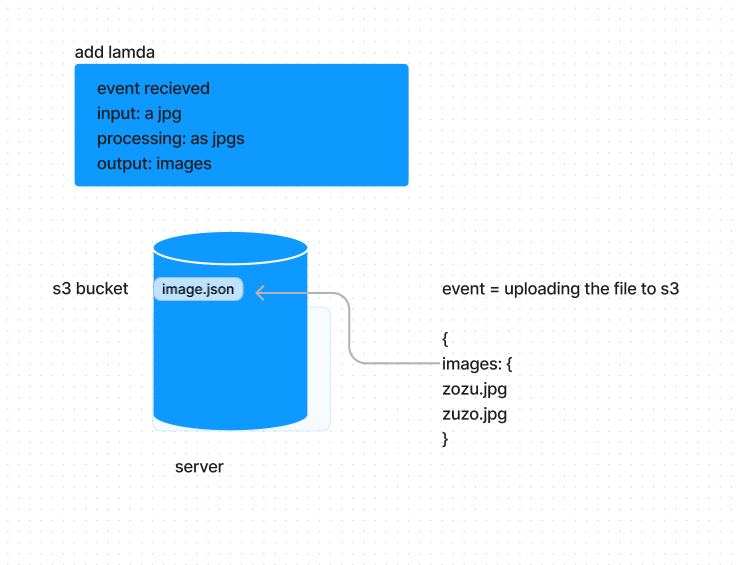

# s3-image

Image Json download link.

https://zusolarisbucket.s3.us-west-2.amazonaws.com/images.json

## How to upload an image json and make a trigger from it. 

Go to the bucket on AWS

Create a new bucket.

Set permissions to s3 GetObject and S3 PutObject

Set the resource as the name of your bucket's name as the source.

upload the two jpg images 

The images will then be converted into a json file.

## Lambda

Go to Lambda create a function

Go to trigger configuration and add s3 as a trigger.

Add the suffix as .jpg

Change the bucket name to your bucket.

Deploy and voila click on the link and your image should be deployed! :D

